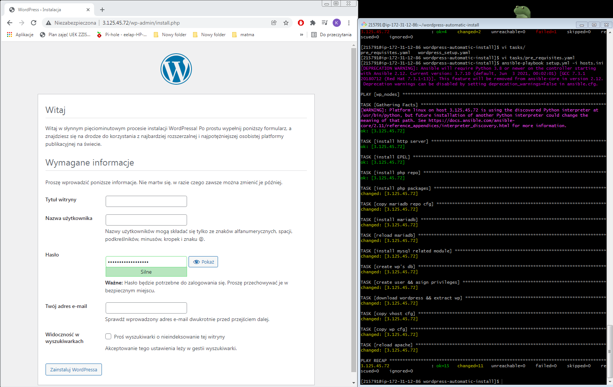

Automatic Wordpress installation

How to:

1. Get your host/hosts where you want your wordpress to be set up ready
2. Modify your hosts.ini file to include ip to the hosts you want.
3. run with command: "ansible-playbook setup.yml -i hosts.ini"
4. verify the wordpress works by going to the page
5. profit

Step by step explanation:
1. Will install httpd server
2. Will install EPEL
3. Will add php repo
4. Will install necessary php packages
5. Will copy mariadb repo config
6. Will install mariadb
7. Will reload/restart service of mariadb
8. Will install mysql
9. Will create a database for wordpress
10. Will create a user with correct privileges for wordpress
11. Will download wordpress in tar.gz and extract it
12. Will copy vhost config
13. Will copy wordpress config
14. Will reload httpd